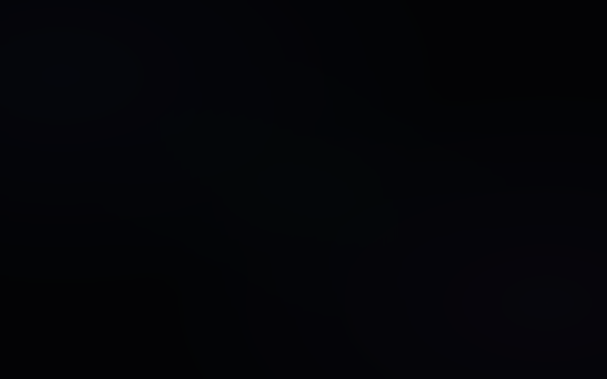
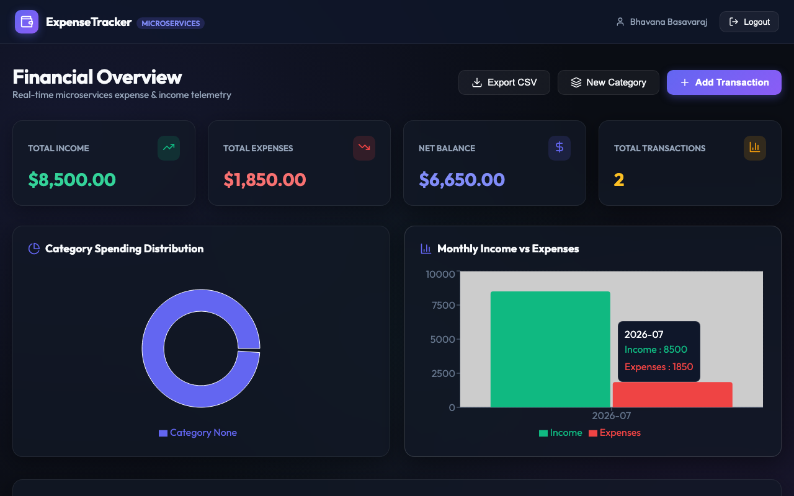
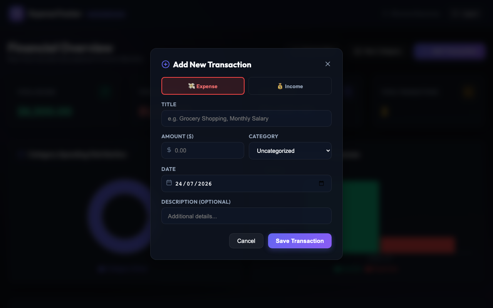

# 💰 Expense Tracker Microservices Platform

[](https://github.com/BhavanaBasavaraj/expense-tracker-microservices/actions/workflows/ci.yml)
[](./run_tests.sh)
[](./docker-compose.yml)
[](LICENSE)

A production-ready, cloud-native microservices application built with **FastAPI**, **PostgreSQL**, **Redis**, **Alembic**, and a **Vite / React / TypeScript** web dashboard. 

---

## 🎨 User Interface Screenshots

### 1. Authentication & Security Screen
Tabbed login and user registration modal with JWT bearer authentication.


### 2. Live Financial Overview Dashboard
Real-time financial telemetry, KPI summary cards, Recharts spending breakdown, and transaction history table.


### 3. Add Transaction Modal
Modal interface for recording income and expense entries with custom categories.


---

## 🚀 Key Microservices Architecture & Features

```
                              ┌───────────────────────┐
                              │  Vite React Frontend  │
                              │     (Port 3000)       │
                              └───────────┬───────────┘
                                          │
                                          ▼
                              ┌───────────────────────┐
                              │      API Gateway      │
                              │     (Port 8000)       │
                              └─────┬─────┬─────┬─────┘
                                    │     │     │
            ┌───────────────────────┼─────┴─────┼───────────────────────┐
            │                       │           │                       │
            ▼                       ▼           ▼                       ▼
 ┌─────────────────────┐ ┌───────────────────┐ ┌───────────────────┐ ┌────────────────────┐
 │    Auth Service     │ │  Expense Service  │ │ Category Service  │ │ Analytics Service  │
 │     (Port 8001)     │ │    (Port 8002)    │ │    (Port 8003)    │ │    (Port 8004)     │
 └──────────┬──────────┘ └─────────┬─────────┘ └─────────┬─────────┘ └────────────────────┘
            │                      │                     │
            └──────────────────────┼─────────────────────┘
                                   ▼
                        ┌─────────────────────┐
                        │ PostgreSQL Database │
                        │     (Port 5433)     │
                        └─────────────────────┘
```

1. **Centralized Gateway Authentication:**
   - **API Gateway (`port 8000`)** verifies JWT tokens centrally and sanitizes incoming HTTP headers.
   - Verified `X-User-ID` and `X-User-Email` headers are passed to downstream microservices, eliminating 100% of inter-service auth HTTP round-trips.

2. **Database Migrations & Resilience:**
   - Database schema migrations managed via **Alembic** for `auth-service`, `expense-service`, and `category-service`.
   - Entrypoint scripts automatically execute `alembic upgrade head` on startup.

3. **Rate Limiting & Caching:**
   - **Redis (`port 6379`)** integration with `Slowapi` rate-limiting on authentication endpoints (`10 req/min`).

4. **Modern Frontend Web Application:**
   - **React 18 + Vite 5 + TypeScript** web application styled with glassmorphism design system.
   - Recharts visual charts for category spending breakdown & monthly income vs expenses.
   - One-click CSV financial log exports.

5. **Hardened Unprivileged Docker Containers:**
   - 2-stage multi-stage builds running under non-root `appuser:appgroup`.

---

## 🛠 Prerequisites & Local Setup

### Running with Docker Compose (Recommended)

To start the entire microservices stack (PostgreSQL, Redis, Auth, Expense, Category, Analytics, API Gateway, and Frontend):

```bash
docker-compose up --build
```

Access services locally:
- 🌐 **Web Dashboard:** `http://localhost:3000`
- ⚙️ **API Gateway:** `http://localhost:8000`
- 🔒 **Auth Service:** `http://localhost:8001`
- 💸 **Expense Service:** `http://localhost:8002`
- 🏷️ **Category Service:** `http://localhost:8003`
- 📊 **Analytics Service:** `http://localhost:8004`

---

## 🧪 Testing & Code Coverage (>95% Threshold)

### Running Backend Python Unit & Integration Tests

```bash
./run_tests.sh
```

Our automated script enforces `--cov-fail-under=95` code coverage across all microservices:
- **Auth Service:** 100.00% Coverage
- **Expense Service:** 98.31% Coverage
- **Category Service:** 97.87% Coverage
- **Analytics Service:** 97.78% Coverage
- **API Gateway:** 96.49% Coverage
- **Alembic Migrations:** 100% Verified

### Running Frontend Component Tests

```bash
cd frontend
npm test
```

---

## 📡 API Endpoints Summary

| Service | Method | Path | Description |
| :--- | :--- | :--- | :--- |
| **Gateway / Auth** | `POST` | `/auth/register` | User registration |
| **Gateway / Auth** | `POST` | `/auth/login` | Bearer JWT login |
| **Gateway / Auth** | `GET` | `/auth/me` | Get profile details |
| **Gateway / Expense** | `GET` | `/expenses/` | List user expenses |
| **Gateway / Expense** | `POST` | `/expenses/` | Create expense/income item |
| **Gateway / Expense** | `DELETE` | `/expenses/{id}` | Delete transaction item |
| **Gateway / Category** | `GET` | `/categories/` | List categories |
| **Gateway / Category** | `POST` | `/categories/` | Create custom category |
| **Gateway / Analytics**| `GET` | `/analytics/dashboard` | KPI Summary telemetry |
| **Gateway / Analytics**| `GET` | `/analytics/by-category`| Category spending breakdown |
| **Gateway / Analytics**| `GET` | `/analytics/monthly` | Monthly income vs expenses |

---

## 📄 License

Distributed under the MIT License.
